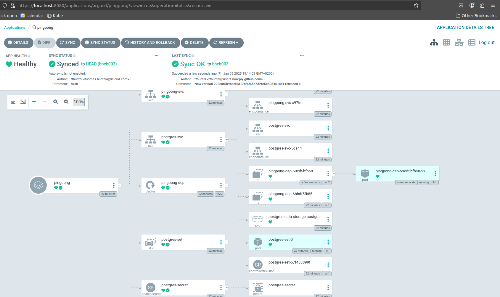

# Exercise 4.07

Installed the argoCD and by following the courses instructions.

Changed the sops encrypted secret to sealedsecret

Then created the argo application

And then updated the GHA workflow for pingpong



# Exercise 4.01

```bash
tuomas@zoe:~/kurssit/kube$ kubectl get pods
NAME                            READY   STATUS    RESTARTS          AGE
my-busybox                      1/1     Running   112 (4m17s ago)   72d
postgres-set-0                  1/1     Running   1 (4m7s ago)      6m44s
pingpong-dep-6bbdf5fb85-lqgzz   1/1     Running   0                 6m44s
logoutput-dep-97b5cb7ff-mpcs2   2/2     Running   0                 2m34s

tuomas@zoe:~/kurssit/kube$ kubectl get pods -o jsonpath='{range .items[*]}{.metadata.name}{"\t"}{.spec.containers[*].name}{"\t"}{.spec.containers[*].readinessProbe}{"\n"}{end}'
my-busybox      busybox
postgres-set-0  postgres
pingpong-dep-6bbdf5fb85-lqgzz   pingpong        {"failureThreshold":3,"httpGet":{"path":"/health","port":3000,"scheme":"HTTP"},"initialDelaySeconds":5,"periodSeconds":5,"successThreshold":1,"timeoutSeconds":1}
logoutput-dep-97b5cb7ff-mpcs2   logoutput logoutput-hasher      {"failureThreshold":3,"httpGet":{"path":"/health","port":3000,"scheme":"HTTP"},"initialDelaySeconds":5,"periodSeconds":5,"successThreshold":1,"timeoutSeconds":1}
```

# Exercise 3.09

New resource limits are cpu 150m and memory 100Mi 

# Exercise 3.01

```bash
tuomas@zoe:~/kurssit/kube$ gcloud container clusters create dwk-cluster --zone=europe-north1-b --cluster-version=1.31
Note: The Kubelet readonly port (10255) is now deprecated. Please update your workloads to use the recommended alternatives. See https://cloud.google.com/kubernetes-engine/docs/how-to/disable-kubelet-readonly-port for ways to check usage and for migration instructions.
Note: Your Pod address range (`--cluster-ipv4-cidr`) can accommodate at most 1008 node(s).
Creating cluster dwk-cluster in europe-north1-b... Cluster is being health-checked (Kubernetes Control P
lane is healthy)...done.
Created [https://container.googleapis.com/v1/projects/skilful-alpha-441414-r8/zones/europe-north1-b/clusters/dwk-cluster].
To inspect the contents of your cluster, go to: https://console.cloud.google.com/kubernetes/workload_/gcloud/europe-north1-b/dwk-cluster?project=skilful-alpha-441414-r8
kubeconfig entry generated for dwk-cluster.
NAME         LOCATION         MASTER_VERSION      MASTER_IP       MACHINE_TYPE  NODE_VERSION        NUM_NODES  STATUS
dwk-cluster  europe-north1-b  1.31.1-gke.1846000  35.228.220.236  e2-medium     1.31.1-gke.1846000  3          RUNNING
tuomas@zoe:~/kurssit/kube$ kubens
default
gke-managed-cim
gke-managed-system
gke-managed-volumepopulator
gmp-public
gmp-system
kube-node-lease
kube-public
kube-system
tuomas@zoe:~/kurssit/kube$ kubectl create namespace exercises
namespace/exercises created
tuomas@zoe:~/kurssit/kube$ kubens exercises
Context "gke_skilful-alpha-441414-r8_europe-north1-b_dwk-cluster" modified.
Active namespace is "exercises".
tuomas@zoe:~/kurssit/kube$ kubectl get pods
No resources found in exercises namespace.
tuomas@zoe:~/kurssit/kube$ kubectl apply -f pingpong/manifests/postgres.yaml
service/postgres-svc created
statefulset.apps/postgres-set created
tuomas@zoe:~/kurssit/kube$ kubectl apply -f pingpong/manifests/secret.yaml
secret/postgres-secret created
tuomas@zoe:~/kurssit/kube$ kubectl apply -f pingpong/manifests/deployment.yaml
deployment.apps/pingpong-dep created
tuomas@zoe:~/kurssit/kube$ v .
tuomas@zoe:~/kurssit/kube$ kubectl apply -f pingpong/manifests/service.yaml
service/pingpong-svc created
tuomas@zoe:~/kurssit/kube$ kubectl get svc
NAME           TYPE           CLUSTER-IP       EXTERNAL-IP     PORT(S)        AGE
pingpong-svc   LoadBalancer   34.118.232.102   35.228.80.104   80:31361/TCP   51s
postgres-svc   ClusterIP      None             <none>          5432/TCP       89s
tuomas@zoe:~/kurssit/kube$ curl http://35.228.80.104/pingpong

Ping / Pongs: 0tuomas@zoe:~/kurssit/kube$ curl http://35.228.80.104/pingpong

Ping / Pongs: 1tuomas@zoe:~/kurssit/kube$ curl http://35.228.80.104/pingpong

Ping / Pongs: 2

# Exercise 2.07
```bash
tuomas@zoe:~/kurssit/kube$ kubens
kube-system
kube-public
kube-node-lease
default
exercises
project
tuomas@zoe:~/kurssit/kube$ kubectl get pods
NAME                            READY   STATUS    RESTARTS       AGE
my-busybox                      1/1     Running   0              118m
postgres-set-0                  1/1     Running   0              19m
pingpong-dep-c5c84557b-ln2mp    1/1     Running   10 (22m ago)   107m
logoutput-dep-5d96fb7cc-ng9xk   2/2     Running   0              29s
tuomas@zoe:~/kurssit/kube$ curl localhost:8081
file content: This text is from a file

MESSAGE: hello world
2024-10-09T13:23:17.322Z: 817e6e9e-2783-46da-a9b0-61aad9b67a9b.

Ping / Pongs: 4
```
# Exercise 1.11

```bash

tuomas@zoe:~/kurssit/kube$ kubectl apply -f manifests/
persistentvolume/example-pv created
tuomas@zoe:~/kurssit/kube$ kubectl apply -f log_output/manifests/
deployment.apps/logoutput-dep created
ingress.networking.k8s.io/logoutput-ingress created
persistentvolumeclaim/image-claim created
service/logoutput-svc created
tuomas@zoe:~/kurssit/kube$ kubectl apply -f pingpong/manifests/
deployment.apps/pingpong-dep created
service/pingpong-svc created
tuomas@zoe:~/kurssit/kube$ kubectl get pods
NAME                             READY   STATUS    RESTARTS   AGE
logoutput-dep-59cc8d9c56-p6drs   2/2     Running   0          18s
pingpong-dep-865f998884-6q6s9    1/1     Running   0          9s
tuomas@zoe:~/kurssit/kube$ curl -L localhost:8081
ENOENT: no such file or directory, open 'files/pong.txt'
tuomas@zoe:~/kurssit/kube$ v .
tuomas@zoe:~/kurssit/kube$ curl -L localhost:8081/pingpong
pong 1
tuomas@zoe:~/kurssit/kube$ curl -L localhost:8081/pingpong
pong 2
tuomas@zoe:~/kurssit/kube$ curl -L localhost:8081/
2024-09-20T12:55:55.613Z: 307c9f51-c780-43c3-9644-9ed0b00a590f. Ping / Pongs: 2
```

# Exercise 1.09

```bash
tuomas@zoe:~/kurssit/kube$ kubectl apply -f log_output/manifests/
deployment.apps/logoutput-dep unchanged
ingress.networking.k8s.io/logoutput-ingress configured
service/logoutput-svc unchanged
tuomas@zoe:~/kurssit/kube$ kubectl apply -f log_output/manifests/
deployment.apps/logoutput-dep unchanged
ingress.networking.k8s.io/logoutput-ingress unchanged
service/logoutput-svc unchanged
tuomas@zoe:~/kurssit/kube$ kubectl apply -f pingpong/manifests/
deployment.apps/pingpong-dep created
service/pingpong-svc created
tuomas@zoe:~/kurssit/kube$ curl -L localhost:8081/pingpong
pong 1tuomas@zoe:~/kurssit/kube$ curl -L localhost:8081/pingpong
pong 2tuomas@zoe:~/kurssit/kube$ curl -L localhost:8081/pingpong
pong 3tuomas@zoe:~/kurssit/kube$ curl -L localhost:8081/pingpong
pong 4
```
