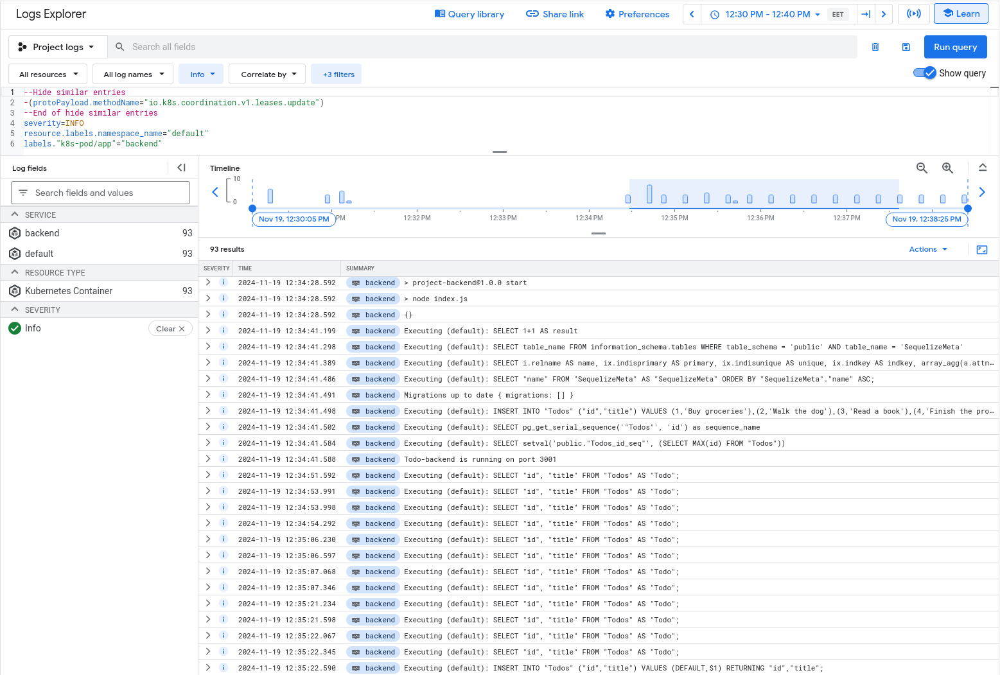
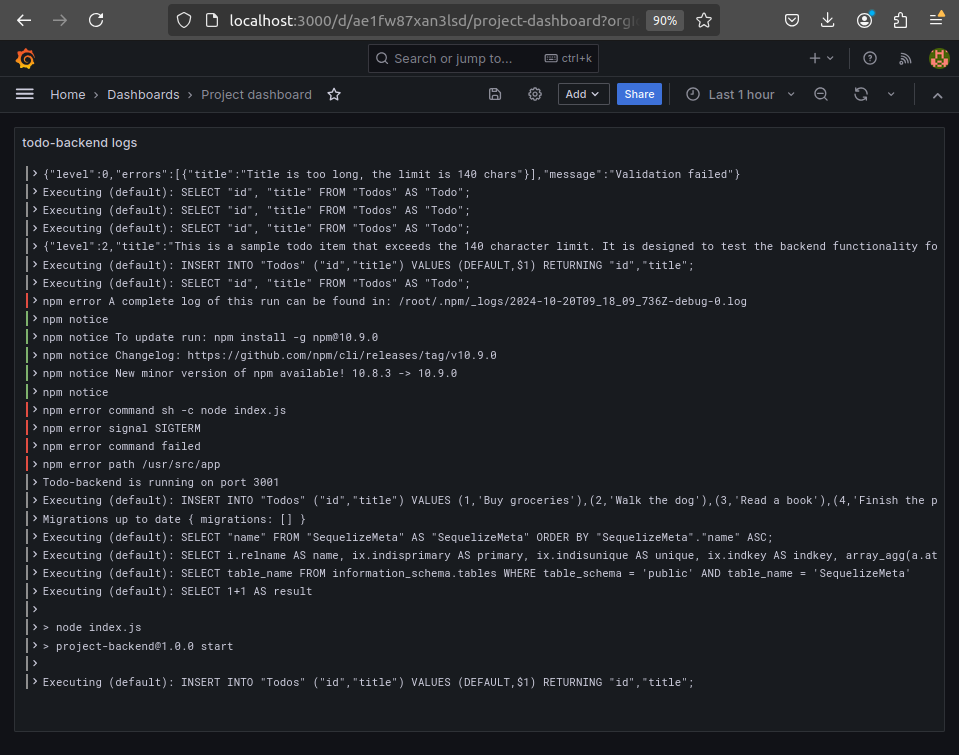

# Exercise 3.10



# Exercise 3.08

Set the limits to 150m cpu and 100Mi memory

# Exercise 3.07

made cronjob script and yaml files for backup cronjob also I added serviceAccountName to backupcronjob.yaml file

and then ran these commands

```bash

tuomas@zoe:~/kurssit/kube$ kubectl create serviceaccount github-actions --namespace default
serviceaccount/github-actions created

tuomas@zoe:~/kurssit/kube$ kubectl get serviceaccounts
NAME             SECRETS   AGE
default          0         22m
github-actions   0         16m

tuomas@zoe:~/kurssit/kube$ gcloud iam service-accounts add-iam-policy-binding \
  github-actions@PROJECT_ID.iam.gserviceaccount.com \
  --member="serviceAccount:PROJECT_ID.svc.id.goog[default/github-actions]" \
  --role="roles/iam.workloadIdentityUser"
Updated IAM policy for serviceAccount [github-actions@PROJECT_ID.iam.gserviceaccount.com].
bindings:
- members:
  - serviceAccount:PROJECT_ID.svc.id.goog[default/github-actions]
  role: roles/iam.workloadIdentityUser
etag: BwYnQAWzYuI=
version: 1
tuomas@zoe:~/kurssit/kube$ kubectl annotate serviceaccount github-actions --namespace default iam.gke.io/gcp-service-account=github-actions@PROJECT_ID.iam.gserviceaccount.com
serviceaccount/github-actions annotated

tuomas@zoe:~/kurssit/kube$ gcloud container node-pools list --cluster=dwk-cluster --zone=europe-north1-b
NAME          MACHINE_TYPE  DISK_SIZE_GB  NODE_VERSION
default-pool  e2-medium     100           1.29.9-gke.1496000

tuomas@zoe:~/kurssit/kube$ gcloud container node-pools update default-pool --cluster=dwk-cluster --zone=europe-north1-b --workload-metadata=GKE_METADATA
Updating node pool default-pool... Updating default-pool, done with 2 out of 3 nodes (66.7%): 1 being processed, 2 succeeded...done.
Updated [https://container.googleapis.com/v1/projects/PROJECT_ID/zones/europe-north1-b/clusters/dwk-cluster/nodePools/default-pool].
```
Then I manually triggered the cronjob from lens

```bash
tuomas@zoe:~/kurssit/kube$ kubectl get po
NAME                           READY   STATUS      RESTARTS      AGE
backend-dep-6c599db55c-9cd64   1/1     Running     2 (21m ago)   42m
pg-backup-manual-5c7mg-8c7n8   0/1     Completed   0             2m4s
postgres-set-0                 1/1     Running     0             42m
project-dep-5d89894f8-5g7p9    1/1     Running     1 (21m ago)   42m
todo-cron-28866780-swcz2       0/1     Completed   0             36m

tuomas@zoe:~/kurssit/kube$ gsutil ls gs://postgres-backup-tfhuhtal
gs://postgres-backup-tfhuhtal/backup-2024-11-19.sql
```

# Exercise 3.06

Check the readme

# Exercise 3.05

I added branch testing and then deleted it 

```bash
tuomas@zoe:~/kurssit/kube$ curl -L http://34.36.246.152
<html><head><title>todo-app</title></head><body><form id="todo-form" action="?" method="POST"><input id="todo-input" type="text" name="title" maxlength="140" required="required"/><button type="submit">Send</button></form><ul><li>Buy groceries</li><li>Walk the dog</li><li>Read a book</li><li>Finish the project report</li><li>Read https://en.wikipedia.org/wiki/Pulmonoscorpius</li></ul></body></html>t
```

# Exercise 3.03 && 3.05

```bash

Run kubectl get namespace $***NAMESPACE*** || kubectl create namespace $***NAMESPACE***
NAME      STATUS   AGE
default   Active   6m2s
Context "gke_***_europe-north1-b_dwk-cluster" modified.
secret/postgres-secret created
service/backend-svc created
service/postgres-db-svc created
service/project-svc created
persistentvolumeclaim/project-claim created
deployment.apps/backend-dep created
deployment.apps/project-dep created
statefulset.apps/postgres-set created
cronjob.batch/todo-cron created
ingress.networking.k8s.io/project-ingress created
Waiting for deployment "backend-dep" rollout to finish: 0 of 1 updated replicas are available...
deployment "backend-dep" successfully rolled out
Waiting for deployment "project-dep" rollout to finish: 0 of 1 updated replicas are available...
deployment "project-dep" successfully rolled out
NAME              TYPE        CLUSTER-IP       EXTERNAL-IP   PORT(S)          AGE     SELECTOR
backend-svc       NodePort    34.118.225.222   <none>        2345:32558/TCP   21s     app=backend
kubernetes        ClusterIP   34.118.224.1     <none>        443/TCP          6m22s   <none>
postgres-db-svc   ClusterIP   None             <none>        5432/TCP         21s     app=postgres
project-svc       NodePort    34.118.238.143   <none>        2345:31018/TCP   20s     app=project
```

pasted from gha

# Exercise 2.10


```bash
tuomas@zoe:~/kurssit/kube/project$ kubectl get pods -o wide
NAME                           READY   STATUS      RESTARTS       AGE    IP            NODE                       NOMINATED NODE   READINESS GATES
postgres-set-0                 1/1     Running     4 (4h8m ago)   9d     10.42.1.84    k3d-k3s-default-agent-1    <none>           <none>
project-dep-7d4cdc4f46-ts486   1/1     Running     0              175m   10.42.0.120   k3d-k3s-default-agent-0    <none>           <none>
todo-cron-manual-us0w5-zfvlx   0/1     Completed   0              131m   10.42.1.89    k3d-k3s-default-agent-1    <none>           <none>
todo-cron-28823700-nbrrh       0/1     Completed   0              73m    10.42.0.124   k3d-k3s-default-agent-0    <none>           <none>
my-busybox                     1/1     Running     2 (23m ago)    143m   10.42.2.100   k3d-k3s-default-server-0   <none>           <none>
todo-cron-28823760-9rq7s       0/1     Completed   0              13m    10.42.0.127   k3d-k3s-default-agent-0    <none>           <none>
backend-dep-859bfcddc8-58tc5   1/1     Running     0              8m6s   10.42.0.128   k3d-k3s-default-agent-0    <none>           <none>
tuomas@zoe:~/kurssit/kube/project$ curl -X POST http://localhost:8080/todos -H "Content-Type: application/json" -d '{
  "title": "This is a sample todo item that exceeds the 140 character limit. It is designed to test the backend functionality for handling long text inputs, ensuring that the system can process and store lengthy todo items without any issues."
}'
{"errors":[{"title":"Title is too long, the limit is 140 chars"}]}
```
Also I am port-forwarding backend-svc
```bash
tuomas@zoe:~$ kubectl port-forward service/backend-svc 8080:2345
Forwarding from 127.0.0.1:8080 -> 3001
Forwarding from [::1]:8080 -> 3001
Handling connection for 8080
```

# Exercise 2.09
```bash
tuomas@zoe:~/kurssit/kube$ kubectl apply -f project/manifests/todocron.yaml
cronjob.batch/todo-cron configured
tuomas@zoe:~/kurssit/kube$ kubectl get pods
NAME                           READY   STATUS      RESTARTS       AGE
postgres-set-0                 1/1     Running     4 (117m ago)   9d
project-dep-7d4cdc4f46-ts486   1/1     Running     0              44m
backend-dep-6b649987cc-wlbfg   1/1     Running     0              44m
my-busybox                     1/1     Running     0              12m
todo-cron-28823640-xk8n6       0/1     Completed   0              2m53s
todo-cron-manual-xcuad-jq92g   0/1     Completed   0              63s
todo-cron-manual-us0w5-zfvlx   0/1     Completed   0              33s
tuomas@zoe:~/kurssit/kube$ kubectl get jobs
NAME                     COMPLETIONS   DURATION   AGE
todo-cron-28823640       1/1           6s         3m3s
todo-cron-manual-xcuad   1/1           7s         73s
todo-cron-manual-us0w5   1/1           8s         43s
tuomas@zoe:~/kurssit/kube$ kubectl logs todo-cron-manual-us0w5-zfvlx
{"message":"Todo created"}created todo Read https://en.wikipedia.org/wiki/Rhamnulokinase
```

# Exercise 2.08
```bash
tuomas@zoe:~/kurssit/kube/project$ kubens
kube-system
kube-public
kube-node-lease
default
exercises
project
tuomas@zoe:~/kurssit/kube/project$ kubectl get pods
NAME                           READY   STATUS    RESTARTS        AGE
postgres-set-0                 1/1     Running   0               27m
backend-dep-6b649987cc-ch54d   1/1     Running   4 (8m51s ago)   27m
project-dep-7d4cdc4f46-lrtn6   1/1     Running   3 (8m51s ago)   11m
tuomas@zoe:~/kurssit/kube/project$ curl -l localhost:8081
<html><head><title>todo-app</title></head><body><form id="todo-form" action="?" method="POST"><input id="todo-input" type="text" name="title" maxlength="140" required="required"/><button type="submit">Send</button></form><ul><li>Buy groceries</li><li>Walk the dog</li><li>Read a book</li><li>Finish the project report</li><li>Moi</li></ul></body></html>
```
- The last li with moi is posted on database using this form, (it is not included in seeding)

# Exercise 2.04
```bash
tuomas@zoe:~/kurssit/kube$ kubectl apply -f manifests/
persistentvolume/example-pv-meta created
persistentvolume/project-pv-meta created
tuomas@zoe:~/kurssit/kube$ kubectl apply -f project/manifests/
deployment.apps/project-dep created
deployment.apps/backend-dep created
ingress.networking.k8s.io/project-ingress created
persistentvolumeclaim/project-claim created
service/project-svc created
service/backend-svc created
tuomas@zoe:~/kurssit/kube$ kubens
kube-system
kube-public
kube-node-lease
default
exercises
project
tuomas@zoe:~/kurssit/kube$ kubectl get pods --namespace=project
NAME                           READY   STATUS    RESTARTS   AGE
backend-dep-7c96747dff-p876s   1/1     Running   0          31s
project-dep-7989df8fd9-pskcd   1/1     Running   0          31s
tuomas@zoe:~/kurssit/kube$
```

# Exercise 2.02

```bash
tuomas@zoe:~/kurssit/kube$ docker build -t tfhuhtal/todo-app:v1.05 project/todo-app
tuomas@zoe:~/kurssit/kube$ docker push tfhuhtal/todo-app:v1.05
The push refers to repository [docker.io/tfhuhtal/todo-app]
a12a4200cc24: Pushed
fc6d7eb830f8: Layer already exists
ca1f7333bc7f: Layer already exists
1052b457b067: Layer already exists
6a8f65b6edec: Layer already exists
b298ceddbfb8: Layer already exists
44b1b6f4e77e: Layer already exists
63ca1fbb43ae: Layer already exists
v1.05: digest: sha256:5248f76b192b9850649478037fd616d7d29ab9ef105306f8f9cec7abc84f65d6 size: 1996
tuomas@zoe:~/kurssit/kube$ v .
tuomas@zoe:~/kurssit/kube$ kubectl apply -f project/manifests/deployment.yaml
deployment.apps/project-dep configured
deployment.apps/backend-dep unchanged
tuomas@zoe:~/kurssit/kube$ kubectl delete -f project/manifests/deployment.yaml
deployment.apps "project-dep" deleted
deployment.apps "backend-dep" deleted
tuomas@zoe:~/kurssit/kube$ kubectl apply -f project/manifests/deployment.yaml
deployment.apps/project-dep created
deployment.apps/backend-dep created
tuomas@zoe:~/kurssit/kube$ kubectl get pods
NAME                           READY   STATUS    RESTARTS   AGE
project-dep-7989df8fd9-mr2qh   1/1     Running   0          77s
backend-dep-7c96747dff-4vtjr   1/1     Running   0          77s
tuomas@zoe:~/kurssit/kube$ kubectl get svc,ing,pvc
NAME                  TYPE        CLUSTER-IP     EXTERNAL-IP   PORT(S)    AGE
service/kubernetes    ClusterIP   10.43.0.1      <none>        443/TCP    31d
service/project-svc   ClusterIP   10.43.215.11   <none>        2345/TCP   19m
service/backend-svc   ClusterIP   10.43.13.193   <none>        2345/TCP   19m

NAME                                        CLASS     HOSTS   ADDRESS                            PORTS   AGE
ingress.networking.k8s.io/project-ingress   traefik   *       172.19.0.2,172.19.0.3,172.19.0.4   80      19m

NAME                                  STATUS   VOLUME            CAPACITY   ACCESS MODES   STORAGECLASS   AGE
persistentvolumeclaim/project-claim   Bound    project-pv-meta   1Gi        RWO            project-pv     19m
tuomas@zoe:~/kurssit/kube$ curl localhost:8081
<html><head><title>todo-app</title></head><body><form id="todo-form" action="?" method="POST"><input id="todo-input" type="text" name="title" maxlength="140" required="required"/><button type="submit">Send</button></form><ul><li>Buy groceries</li><li>Walk the dog</li><li>Read a book</li><li>Finish the project report</li><li>wuf wuf</li><li>wuf wuf2</li></ul></body></html>
```

# Exercise 1.13

```bash

tuomas@zoe:~/kurssit/kube$ docker build -t tfhuhtal/project:v0.7 ./project/
tuomas@zoe:~/kurssit/kube$ docker push tfhuhtal/project:v0.7
The push refers to repository [docker.io/tfhuhtal/project]
35ab9b8e0f30: Pushed
6b70d770b48f: Layer already exists
a8699d4c5533: Layer already exists
1052b457b067: Layer already exists
6a8f65b6edec: Layer already exists
b298ceddbfb8: Layer already exists
44b1b6f4e77e: Layer already exists
63ca1fbb43ae: Layer already exists
v0.7: digest: sha256:f8b21a61ab113a76e88a83184cf399eca77dec647399efcc9b460b64bc7ea956 size: 1995
tuomas@zoe:~/kurssit/kube$ v .
tuomas@zoe:~/kurssit/kube$ kubectl delete -f project/manifests/deployment.yaml
deployment.apps "project-dep" deleted
tuomas@zoe:~/kurssit/kube$ kubectl apply -f project/manifests/deployment.yaml
deployment.apps/project-dep created
tuomas@zoe:~/kurssit/kube$ kubectl get pods
NAME                           READY   STATUS              RESTARTS   AGE
project-dep-84d7bf6cb7-qcrvf   0/1     ContainerCreating   0          5s
tuomas@zoe:~/kurssit/kube$ kubectl get pods
NAME                           READY   STATUS    RESTARTS   AGE
project-dep-84d7bf6cb7-qcrvf   1/1     Running   0          53s
```


# Exercise 1.12

```bash
tuomas@zoe:~/kurssit/kube$ kubectl apply -f manifests/
persistentvolume/project-pv-meta created
tuomas@zoe:~/kurssit/kube$ kubectl apply -f project/manifests/
deployment.apps/project-dep created
ingress.networking.k8s.io/project-ingress created
persistentvolumeclaim/project-claim created
service/project-svc created
tuomas@zoe:~/kurssit/kube$ kubectl get pods
NAME                           READY   STATUS    RESTARTS   AGE
project-dep-6644cd6ddb-wgzpm   1/1     Running   0          46s
tuomas@zoe:~/kurssit/kube$ curl -L localhost:8081
Warning: Binary output can mess up your terminal. Use "--output -" to tell
Warning: curl to output it to your terminal anyway, or consider "--output
Warning: <FILE>" to save to a file.
```


# Exercise 1.08

```bash
tuomas@zoe:~/kurssit/kube/project$ kubectl apply -f manifests/
deployment.apps/project-dep created
ingress.networking.k8s.io/project-ingress created
service/project-svc created
tuomas@zoe:~/kurssit/kube/project$ curl -L localhost:8081
Hellot
```

# Exercise 1.06

```bash
kubectl apply -f manifests/deployment.yaml
deployment.apps/project-dep created

kubectl apply -f manifests/service.yaml
service/project-svc unchanged

kubectl get pods
NAME                             READY   STATUS    RESTARTS   AGE
logoutput-dep-68d589988d-pwv7v   1/1     Running   0          9m46s
project-dep-6f95f8779d-lmlfb     1/1     Running   0          11s

curl localhost:8082
Hello
```

# Exercise 1.05

```bash
kubectl get pods
NAME                             READY   STATUS    RESTARTS      AGE
logoutput-dep-68d589988d-849vm   1/1     Running   1 (24m ago)   23h
project-dep-866679699f-brcvx     1/1     Running   1 (24m ago)   23h
tuomas@zoe:~/kurssit/kube/project$ kubectl port-forward project-dep-866679699f-brcvx 3003:3000
Forwarding from 127.0.0.1:3003 -> 3000
Forwarding from [::1]:3003 -> 3000
Handling connection for 3003
```

And I fetched the html response from localhost:3003 

```bash
curl -L localhost:3003
Hello
```
```

# Exercise 1.04

```bash
kubectl delete deployment project-dep
deployment.apps "project-dep" deleted

kubectl apply -f manifests/deployment.yaml
deployment.apps/project-dep created

kubectl get pods
NAME                             READY   STATUS    RESTARTS   AGE
logoutput-dep-68d589988d-849vm   1/1     Running   0          6m3s
project-dep-866679699f-brcvx     1/1     Running   0          13s

kubectl logs project-dep-866679699f-brcvx

> project@1.0.0 start
> node index.js
```

# Exercise 1.02

```bash
k3d image import tuomas/project:1.02
INFO[0000] Importing image(s) into cluster 'k3s-default'
INFO[0000] Starting new tools node...
INFO[0000] Starting node 'k3d-k3s-default-tools'
INFO[0000] Saving 1 image(s) from runtime...
INFO[0001] Importing images into nodes...
INFO[0001] Importing images from tarball '/k3d/images/k3d-k3s-default-images-20240901182717.tar' into node 'k3d-k3s-default-server-0'...
INFO[0001] Importing images from tarball '/k3d/images/k3d-k3s-default-images-20240901182717.tar' into node 'k3d-k3s-default-agent-1'...
INFO[0001] Importing images from tarball '/k3d/images/k3d-k3s-default-images-20240901182717.tar' into node 'k3d-k3s-default-agent-0'...
INFO[0003] Removing the tarball(s) from image volume...
INFO[0004] Removing k3d-tools node...
INFO[0004] Successfully imported image(s)
INFO[0004] Successfully imported 1 image(s) into 1 cluster(s)

kubectl create deployment project-dep --image=tuomas/project:1.02
deployment.apps/project-dep created

kubectl get pods
NAME                            READY   STATUS    RESTARTS   AGE
logoutput-dep-57745f7fd-f24jg   1/1     Running   0          51m
project-dep-7766bb4d47-x56m8    1/1     Running   0          8s

kubectl logs project-dep-7766bb4d47-x56m8

> project@1.0.0 start
> node index.js

Server started on port 3000
```
