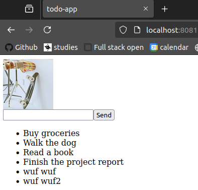
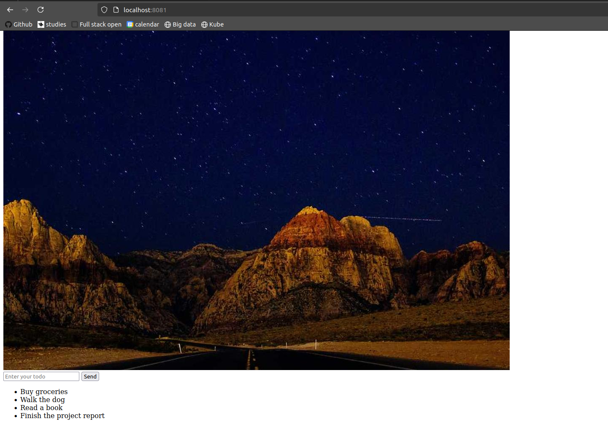
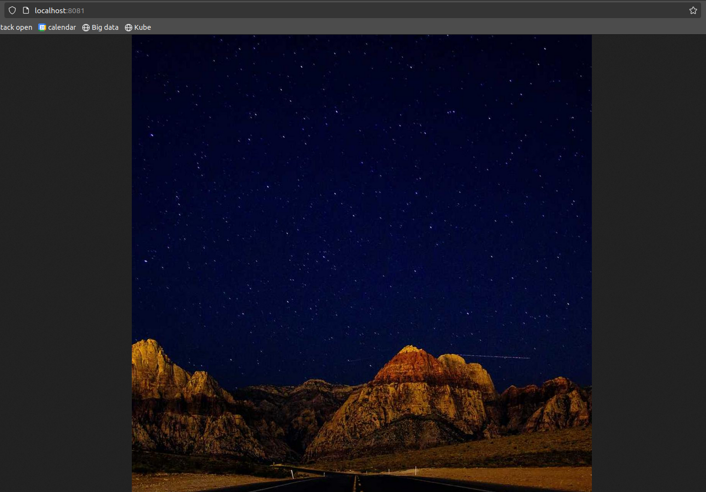

# Exercise 2.09
```bash
tuomas@zoe:~/kurssit/kube$ kubectl apply -f project/manifests/todocron.yaml
cronjob.batch/todo-cron configured
tuomas@zoe:~/kurssit/kube$ kubectl get pods
NAME                           READY   STATUS      RESTARTS       AGE
postgres-set-0                 1/1     Running     4 (117m ago)   9d
project-dep-7d4cdc4f46-ts486   1/1     Running     0              44m
backend-dep-6b649987cc-wlbfg   1/1     Running     0              44m
my-busybox                     1/1     Running     0              12m
todo-cron-28823640-xk8n6       0/1     Completed   0              2m53s
todo-cron-manual-xcuad-jq92g   0/1     Completed   0              63s
todo-cron-manual-us0w5-zfvlx   0/1     Completed   0              33s
tuomas@zoe:~/kurssit/kube$ kubectl get jobs
NAME                     COMPLETIONS   DURATION   AGE
todo-cron-28823640       1/1           6s         3m3s
todo-cron-manual-xcuad   1/1           7s         73s
todo-cron-manual-us0w5   1/1           8s         43s
tuomas@zoe:~/kurssit/kube$ kubectl logs todo-cron-manual-us0w5-zfvlx
{"message":"Todo created"}created todo Read https://en.wikipedia.org/wiki/Rhamnulokinase
```

# Exercise 2.08
```bash
tuomas@zoe:~/kurssit/kube/project$ kubens
kube-system
kube-public
kube-node-lease
default
exercises
project
tuomas@zoe:~/kurssit/kube/project$ kubectl get pods
NAME                           READY   STATUS    RESTARTS        AGE
postgres-set-0                 1/1     Running   0               27m
backend-dep-6b649987cc-ch54d   1/1     Running   4 (8m51s ago)   27m
project-dep-7d4cdc4f46-lrtn6   1/1     Running   3 (8m51s ago)   11m
tuomas@zoe:~/kurssit/kube/project$ curl -l localhost:8081
<html><head><title>todo-app</title></head><body><form id="todo-form" action="?" method="POST"><input id="todo-input" type="text" name="title" maxlength="140" required="required"/><button type="submit">Send</button></form><ul><li>Buy groceries</li><li>Walk the dog</li><li>Read a book</li><li>Finish the project report</li><li>Moi</li></ul></body></html>
```
- The last li with moi is posted on database using this form, (it is not included in seeding)

# Exercise 2.04
```bash
tuomas@zoe:~/kurssit/kube$ kubectl apply -f manifests/
persistentvolume/example-pv-meta created
persistentvolume/project-pv-meta created
tuomas@zoe:~/kurssit/kube$ kubectl apply -f project/manifests/
deployment.apps/project-dep created
deployment.apps/backend-dep created
ingress.networking.k8s.io/project-ingress created
persistentvolumeclaim/project-claim created
service/project-svc created
service/backend-svc created
tuomas@zoe:~/kurssit/kube$ kubens
kube-system
kube-public
kube-node-lease
default
exercises
project
tuomas@zoe:~/kurssit/kube$ kubectl get pods --namespace=project
NAME                           READY   STATUS    RESTARTS   AGE
backend-dep-7c96747dff-p876s   1/1     Running   0          31s
project-dep-7989df8fd9-pskcd   1/1     Running   0          31s
tuomas@zoe:~/kurssit/kube$
```

# Exercise 2.02

```bash
tuomas@zoe:~/kurssit/kube$ docker build -t tfhuhtal/todo-app:v1.05 project/todo-app
tuomas@zoe:~/kurssit/kube$ docker push tfhuhtal/todo-app:v1.05
The push refers to repository [docker.io/tfhuhtal/todo-app]
a12a4200cc24: Pushed
fc6d7eb830f8: Layer already exists
ca1f7333bc7f: Layer already exists
1052b457b067: Layer already exists
6a8f65b6edec: Layer already exists
b298ceddbfb8: Layer already exists
44b1b6f4e77e: Layer already exists
63ca1fbb43ae: Layer already exists
v1.05: digest: sha256:5248f76b192b9850649478037fd616d7d29ab9ef105306f8f9cec7abc84f65d6 size: 1996
tuomas@zoe:~/kurssit/kube$ v .
tuomas@zoe:~/kurssit/kube$ kubectl apply -f project/manifests/deployment.yaml
deployment.apps/project-dep configured
deployment.apps/backend-dep unchanged
tuomas@zoe:~/kurssit/kube$ kubectl delete -f project/manifests/deployment.yaml
deployment.apps "project-dep" deleted
deployment.apps "backend-dep" deleted
tuomas@zoe:~/kurssit/kube$ kubectl apply -f project/manifests/deployment.yaml
deployment.apps/project-dep created
deployment.apps/backend-dep created
tuomas@zoe:~/kurssit/kube$ kubectl get pods
NAME                           READY   STATUS    RESTARTS   AGE
project-dep-7989df8fd9-mr2qh   1/1     Running   0          77s
backend-dep-7c96747dff-4vtjr   1/1     Running   0          77s
tuomas@zoe:~/kurssit/kube$ kubectl get svc,ing,pvc
NAME                  TYPE        CLUSTER-IP     EXTERNAL-IP   PORT(S)    AGE
service/kubernetes    ClusterIP   10.43.0.1      <none>        443/TCP    31d
service/project-svc   ClusterIP   10.43.215.11   <none>        2345/TCP   19m
service/backend-svc   ClusterIP   10.43.13.193   <none>        2345/TCP   19m

NAME                                        CLASS     HOSTS   ADDRESS                            PORTS   AGE
ingress.networking.k8s.io/project-ingress   traefik   *       172.19.0.2,172.19.0.3,172.19.0.4   80      19m

NAME                                  STATUS   VOLUME            CAPACITY   ACCESS MODES   STORAGECLASS   AGE
persistentvolumeclaim/project-claim   Bound    project-pv-meta   1Gi        RWO            project-pv     19m
tuomas@zoe:~/kurssit/kube$ curl localhost:8081
<html><head><title>todo-app</title></head><body><form id="todo-form" action="?" method="POST"><input id="todo-input" type="text" name="title" maxlength="140" required="required"/><button type="submit">Send</button></form><ul><li>Buy groceries</li><li>Walk the dog</li><li>Read a book</li><li>Finish the project report</li><li>wuf wuf</li><li>wuf wuf2</li></ul></body></html>
```

# Exercise 1.13

```bash

tuomas@zoe:~/kurssit/kube$ docker build -t tfhuhtal/project:v0.7 ./project/
tuomas@zoe:~/kurssit/kube$ docker push tfhuhtal/project:v0.7
The push refers to repository [docker.io/tfhuhtal/project]
35ab9b8e0f30: Pushed
6b70d770b48f: Layer already exists
a8699d4c5533: Layer already exists
1052b457b067: Layer already exists
6a8f65b6edec: Layer already exists
b298ceddbfb8: Layer already exists
44b1b6f4e77e: Layer already exists
63ca1fbb43ae: Layer already exists
v0.7: digest: sha256:f8b21a61ab113a76e88a83184cf399eca77dec647399efcc9b460b64bc7ea956 size: 1995
tuomas@zoe:~/kurssit/kube$ v .
tuomas@zoe:~/kurssit/kube$ kubectl delete -f project/manifests/deployment.yaml
deployment.apps "project-dep" deleted
tuomas@zoe:~/kurssit/kube$ kubectl apply -f project/manifests/deployment.yaml
deployment.apps/project-dep created
tuomas@zoe:~/kurssit/kube$ kubectl get pods
NAME                           READY   STATUS              RESTARTS   AGE
project-dep-84d7bf6cb7-qcrvf   0/1     ContainerCreating   0          5s
tuomas@zoe:~/kurssit/kube$ kubectl get pods
NAME                           READY   STATUS    RESTARTS   AGE
project-dep-84d7bf6cb7-qcrvf   1/1     Running   0          53s
```



# Exercise 1.12

```bash
tuomas@zoe:~/kurssit/kube$ kubectl apply -f manifests/
persistentvolume/project-pv-meta created
tuomas@zoe:~/kurssit/kube$ kubectl apply -f project/manifests/
deployment.apps/project-dep created
ingress.networking.k8s.io/project-ingress created
persistentvolumeclaim/project-claim created
service/project-svc created
tuomas@zoe:~/kurssit/kube$ kubectl get pods
NAME                           READY   STATUS    RESTARTS   AGE
project-dep-6644cd6ddb-wgzpm   1/1     Running   0          46s
tuomas@zoe:~/kurssit/kube$ curl -L localhost:8081
Warning: Binary output can mess up your terminal. Use "--output -" to tell
Warning: curl to output it to your terminal anyway, or consider "--output
Warning: <FILE>" to save to a file.
```


# Exercise 1.08

```bash
tuomas@zoe:~/kurssit/kube/project$ kubectl apply -f manifests/
deployment.apps/project-dep created
ingress.networking.k8s.io/project-ingress created
service/project-svc created
tuomas@zoe:~/kurssit/kube/project$ curl -L localhost:8081
Hellot
```

# Exercise 1.06

```bash
kubectl apply -f manifests/deployment.yaml
deployment.apps/project-dep created

kubectl apply -f manifests/service.yaml
service/project-svc unchanged

kubectl get pods
NAME                             READY   STATUS    RESTARTS   AGE
logoutput-dep-68d589988d-pwv7v   1/1     Running   0          9m46s
project-dep-6f95f8779d-lmlfb     1/1     Running   0          11s

curl localhost:8082
Hello
```

# Exercise 1.05

```bash
kubectl get pods
NAME                             READY   STATUS    RESTARTS      AGE
logoutput-dep-68d589988d-849vm   1/1     Running   1 (24m ago)   23h
project-dep-866679699f-brcvx     1/1     Running   1 (24m ago)   23h
tuomas@zoe:~/kurssit/kube/project$ kubectl port-forward project-dep-866679699f-brcvx 3003:3000
Forwarding from 127.0.0.1:3003 -> 3000
Forwarding from [::1]:3003 -> 3000
Handling connection for 3003
```

And I fetched the html response from localhost:3003 

```bash
curl -L localhost:3003
Hello
```
```

# Exercise 1.04

```bash
kubectl delete deployment project-dep
deployment.apps "project-dep" deleted

kubectl apply -f manifests/deployment.yaml
deployment.apps/project-dep created

kubectl get pods
NAME                             READY   STATUS    RESTARTS   AGE
logoutput-dep-68d589988d-849vm   1/1     Running   0          6m3s
project-dep-866679699f-brcvx     1/1     Running   0          13s

kubectl logs project-dep-866679699f-brcvx

> project@1.0.0 start
> node index.js
```

# Exercise 1.02

```bash
k3d image import tuomas/project:1.02
INFO[0000] Importing image(s) into cluster 'k3s-default'
INFO[0000] Starting new tools node...
INFO[0000] Starting node 'k3d-k3s-default-tools'
INFO[0000] Saving 1 image(s) from runtime...
INFO[0001] Importing images into nodes...
INFO[0001] Importing images from tarball '/k3d/images/k3d-k3s-default-images-20240901182717.tar' into node 'k3d-k3s-default-server-0'...
INFO[0001] Importing images from tarball '/k3d/images/k3d-k3s-default-images-20240901182717.tar' into node 'k3d-k3s-default-agent-1'...
INFO[0001] Importing images from tarball '/k3d/images/k3d-k3s-default-images-20240901182717.tar' into node 'k3d-k3s-default-agent-0'...
INFO[0003] Removing the tarball(s) from image volume...
INFO[0004] Removing k3d-tools node...
INFO[0004] Successfully imported image(s)
INFO[0004] Successfully imported 1 image(s) into 1 cluster(s)

kubectl create deployment project-dep --image=tuomas/project:1.02
deployment.apps/project-dep created

kubectl get pods
NAME                            READY   STATUS    RESTARTS   AGE
logoutput-dep-57745f7fd-f24jg   1/1     Running   0          51m
project-dep-7766bb4d47-x56m8    1/1     Running   0          8s

kubectl logs project-dep-7766bb4d47-x56m8

> project@1.0.0 start
> node index.js

Server started on port 3000
```
