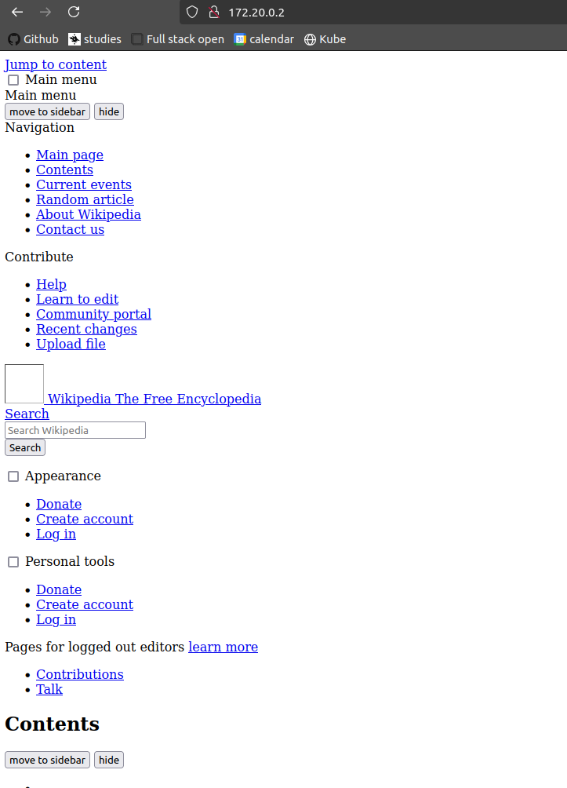

# Exercise 5.06

```bash
tuomas@zoe:~/kurssit/kube$ kubectl get pods -n knative-serving
NAME                                   READY   STATUS    RESTARTS   AGE
controller-5b54cd98c-z8rn8             1/1     Running   0          35s
autoscaler-6c7bf97997-kgj4p            1/1     Running   0          35s
webhook-56ffd84996-4khlp               1/1     Running   0          35s
activator-d66fd5dd8-z7xkv              1/1     Running   0          35s
net-istio-webhook-66b6b6444c-5cbmt     1/1     Running   0          18s
net-istio-controller-c9444c8ff-m8s8p   1/1     Running   0          18s
tuomas@zoe:~/kurssit/kube$ kubectl apply -f https://github.com/knative/serving/releases/download/knative-v1.16.0/serving-default-domain.yaml
job.batch/default-domain created
service/default-domain-service created
tuomas@zoe:~/kurssit/kube$ kubectl apply -f https://github.com/knative/serving/releases/download/knative-v1.16.0/serving-hpa.yaml
deployment.apps/autoscaler-hpa created
service/autoscaler-hpa created
tuomas@zoe:~/kurssit/kube$ kubectl get pods -n knative-serving
NAME                                   READY   STATUS      RESTARTS   AGE
controller-5b54cd98c-z8rn8             1/1     Running     0          88s
autoscaler-6c7bf97997-kgj4p            1/1     Running     0          88s
webhook-56ffd84996-4khlp               1/1     Running     0          88s
activator-d66fd5dd8-z7xkv              1/1     Running     0          88s
net-istio-webhook-66b6b6444c-5cbmt     1/1     Running     0          71s
net-istio-controller-c9444c8ff-m8s8p   1/1     Running     0          71s
autoscaler-hpa-65d7968b4c-twhhc        1/1     Running     0          34s
default-domain-lzdx5                   0/1     Completed   0          44s
tuomas@zoe:~/kurssit/kube$ kn service create hello \
--image ghcr.io/knative/helloworld-go:latest \
--port 8080 \
--env TARGET=World
Warning: Kubernetes default value is insecure, Knative may default this to secure in a future release: spec.template.spec.containers[0].securityContext.allowPrivilegeEscalation, spec.template.spec.containers[0].securityContext.capabilities, spec.template.spec.containers[0].securityContext.runAsNonRoot, spec.template.spec.containers[0].securityContext.seccompProfile
Creating service 'hello' in namespace 'default':

  0.022s The Route is still working to reflect the latest desired specification.
  0.030s ...
  0.050s Configuration "hello" is waiting for a Revision to become ready.
  9.930s ...
  9.953s Ingress has not yet been reconciled.
  9.997s Waiting for load balancer to be ready
 10.194s Ready to serve.

Service 'hello' created to latest revision 'hello-00001' is available at URL:
http://hello.default.172.20.0.2.sslip.io
tuomas@zoe:~/kurssit/kube$ kn service list
NAME    URL                                        LATEST        AGE   CONDITIONS   READY   REASON
hello   http://hello.default.172.20.0.2.sslip.io   hello-00001   31s   3 OK / 3     True
tuomas@zoe:~/kurssit/kube$ echo "Accessing URL $(kn service describe hello -o url)"
curl "$(kn service describe hello -o url)"
Accessing URL http://hello.default.172.20.0.2.sslip.io
Hello World!
tuomas@zoe:~/kurssit/kube$ kubectl get pod -l serving.knative.dev/service=hello -w
NAME                                      READY   STATUS    RESTARTS   AGE
hello-00001-deployment-545c8c74d7-dmvdr   2/2     Running   0          53s
hello-00001-deployment-545c8c74d7-dmvdr   2/2     Terminating   0          100s
hello-00001-deployment-545c8c74d7-dmvdr   1/2     Terminating   0          2m
hello-00001-deployment-545c8c74d7-dmvdr   0/2     Terminating   0          2m10s
hello-00001-deployment-545c8c74d7-dmvdr   0/2     Terminating   0          2m10s
hello-00001-deployment-545c8c74d7-dmvdr   0/2     Terminating   0          2m11s
hello-00001-deployment-545c8c74d7-dmvdr   0/2     Terminating   0          2m11s
tuomas@zoe:~/kurssit/kube$ kn service update hello \ \
--env TARGET=Knative
Warning: Kubernetes default value is insecure, Knative may default this to secure in a future release: spec.template.spec.containers[0].securityContext.allowPrivilegeEscalation, spec.template.spec.containers[0].securityContext.capabilities, spec.template.spec.containers[0].securityContext.runAsNonRoot, spec.template.spec.containers[0].securityContext.seccompProfile
Updating Service 'hello' in namespace 'default':

  0.015s The Configuration is still working to reflect the latest desired specification.
 11.261s Traffic is not yet migrated to the latest revision.
 11.280s Ingress has not yet been reconciled.
 11.311s Waiting for load balancer to be ready
 11.508s Ready to serve.

Service 'hello' updated to latest revision 'hello-00002' is available at URL:
http://hello.default.172.20.0.2.sslip.io
tuomas@zoe:~/kurssit/kube$ echo "Accessing URL $(kn service describe hello -o url)"
curl "$(kn service describe hello -o url)"
Accessing URL http://hello.default.172.20.0.2.sslip.io
Hello Knative!
tuomas@zoe:~/kurssit/kube$ kn revisions list
NAME          SERVICE   TRAFFIC   TAGS   GENERATION   AGE    CONDITIONS   READY   REASON
hello-00002   hello     100%             2            29s    4 OK / 4     True
hello-00001   hello                      1            3m5s   3 OK / 4     True
tuomas@zoe:~/kurssit/kube$ kn service update hello \
--traffic hello-00001=50 \
--traffic @latest=50
Warning: Kubernetes default value is insecure, Knative may default this to secure in a future release: spec.template.spec.containers[0].securityContext.allowPrivilegeEscalation, spec.template.spec.containers[0].securityContext.capabilities, spec.template.spec.containers[0].securityContext.runAsNonRoot, spec.template.spec.containers[0].securityContext.seccompProfile
Updating Service 'hello' in namespace 'default':

  0.015s The Route is still working to reflect the latest desired specification.
  0.045s Ingress has not yet been reconciled.
  0.069s Waiting for load balancer to be ready
  0.270s Ready to serve.

Service 'hello' with latest revision 'hello-00002' (unchanged) is available at URL:
http://hello.default.172.20.0.2.sslip.io
tuomas@zoe:~/kurssit/kube$ kn revisions list
NAME          SERVICE   TRAFFIC   TAGS   GENERATION   AGE     CONDITIONS   READY   REASON
hello-00002   hello     50%              2            49s     4 OK / 4     True
hello-00001   hello     50%              1            3m25s   3 OK / 4     True
tuomas@zoe:~/kurssit/kube$ echo "Accessing URL $(kn service describe hello -o url)"
curl "$(kn service describe hello -o url)"
Accessing URL http://hello.default.172.20.0.2.sslip.io
Hello Knative!
tuomas@zoe:~/kurssit/kube$ curl "$(kn service describe hello -o url)"
Hello World!
tuomas@zoe:~/kurssit/kube$ curl "$(kn service describe hello -o url)"
Hello Knative!
```

# Exercise 5.05

### Rancher vs. OpenShift

#### Rancher
- **Open Source**: Rancher is fully open-source and free to use.
- **Multi-Cluster Management**: Rancher excels in managing multiple Kubernetes clusters across different environments (on-premises, cloud, hybrid).
- **User Interface**: Rancher provides a user-friendly and intuitive UI for managing clusters and workloads.
- **Flexibility**: Rancher supports any certified Kubernetes distribution, giving users the flexibility to choose their preferred Kubernetes version.
- **Lightweight**: Rancher is lightweight and can be easily installed and configured.
- **Community Support**: Strong community support with extensive documentation and active forums.

#### OpenShift
- **Enterprise-Grade**: OpenShift is designed for enterprise use with robust security, compliance, and support features.
- **Integrated CI/CD**: OpenShift includes integrated CI/CD pipelines, making it easier to manage the entire application lifecycle.
- **Developer Tools**: Provides a rich set of developer tools and frameworks, including Source-to-Image (S2I) for building container images.
- **Red Hat Ecosystem**: As part of the Red Hat ecosystem, OpenShift benefits from Red Hat's extensive enterprise support and integration with other Red Hat products.
- **Security**: Strong focus on security with built-in security policies, role-based access control (RBAC), and automated updates.
- **Hybrid Cloud**: Supports hybrid cloud deployments with seamless integration between on-premises and cloud environments.

#### Conclusion
**Better Service Provider: OpenShift**

- **Enterprise Features**: OpenShift's enterprise-grade features, including integrated CI/CD, robust security, and compliance, make it a better choice for large organizations.
- **Developer Experience**: The rich set of developer tools and frameworks provided by OpenShift enhances the developer experience and productivity.
- **Support and Ecosystem**: OpenShift benefits from Red Hat's extensive support and integration with other enterprise products, making it a more comprehensive solution for enterprises.

While Rancher is excellent for multi-cluster management and flexibility, OpenShift's enterprise features and support make it a better choice for organizations looking for a robust, secure, and integrated Kubernetes platform.


# Exercise 5.04

```bash
tuomas@zoe:~/kurssit/kube$ kubectl apply -f wikipedia/manifests/deployment.yaml
deployment.apps/wikipedia-app created
service/wikipedia-app-service created
ingress.networking.k8s.io/wikipedia-app-ingress created
tuomas@zoe:~/kurssit/kube$ kubectl get ing
NAME                    CLASS     HOSTS   ADDRESS                            PORTS   AGE
wikipedia-app-ingress   traefik   *       172.20.0.2,172.20.0.3,172.20.0.4   80      16s
tuomas@zoe:~/kurssit/kube$ kubectl get po
NAME                             READY   STATUS    RESTARTS       AGE
postgres-set-0                   1/1     Running   2 (3h4m ago)   8d
pingpong-dep-dbbc88b48-sw5j6     1/1     Running   2 (3h4m ago)   8d
wikipedia-app-69bbbfd9cb-pcsjq   2/2     Running   0              63s
```

